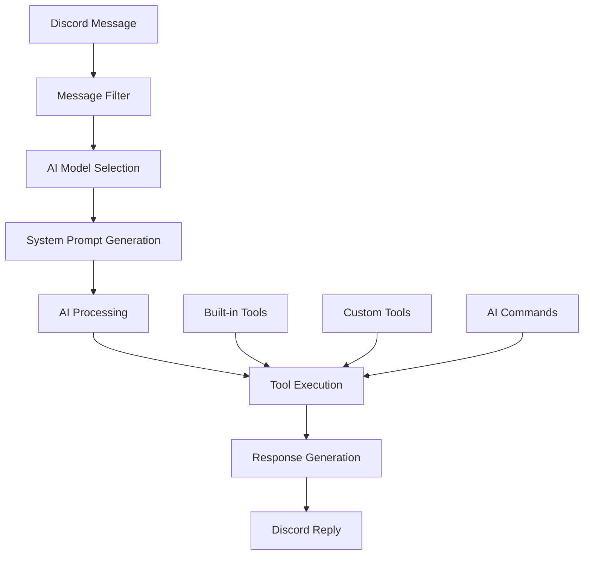

The `@commandkit/ai` plugin allows you to execute your bot commands
using large language models, enabling users to interact with your bot
entirely through natural language.

:::warning

This is an experimental feature and is subject to change.

:::

## Architecture overview



The `@commandkit/ai` plugin basically acts as a smart command handler
that decides which command to execute based on the given prompt.
Similarly, the AI commands are basically an abstraction for tool
calling feature of the large language models. This plugin uses the
[AI SDK](https://ai-sdk.dev) under the hood to interact with large
language models.

## Installation

Install the plugin and your preferred AI SDK:

```bash npm2yarn
npm install @commandkit/ai
```

You also need to install the AI SDK for the model you want to use. For
example, if you want to use Google Gemini:

```bash npm2yarn
npm install @ai-sdk/google
```

Refer to the [AI SDK documentation](https://ai-sdk.dev) for more
information on setting up different AI providers.

## Basic setup

First, add the AI plugin to your CommandKit configuration:

```ts title="commandkit.config.ts"
import { defineConfig } from 'commandkit';
import { ai } from '@commandkit/ai';

export default defineConfig({
  plugins: [ai()],
});
```

Then create an AI configuration file to set up your AI model:

```ts title="src/ai.ts"
import { createGoogleGenerativeAI } from '@ai-sdk/google';
import { configureAI } from '@commandkit/ai';

const google = createGoogleGenerativeAI({
  apiKey: process.env.GOOGLE_API_KEY,
});

configureAI({
  selectAiModel: async (ctx, message) => ({
    model: google.languageModel('gemini-2.0-flash'),
    maxSteps: 5,
    temperature: 0.7,
  }),

  messageFilter: async (commandkit, message) => {
    // Only respond when the bot is mentioned
    return message.mentions.users.has(message.client.user.id);
  },
});
```

Finally, import the configuration in your main application file:

```ts title="src/app.ts"
import { Client, GatewayIntentBits } from 'discord.js';
import './ai'; // Import AI configuration

const client = new Client({
  intents: [
    GatewayIntentBits.Guilds,
    GatewayIntentBits.GuildMessages,
    GatewayIntentBits.MessageContent, // Required for AI to read message content
  ],
});

export default client;
```

## Creating AI commands

To make a command accessible to AI, export an `ai` function and
optional `aiConfig` object from your command file:

```ts title="src/app/commands/greet.ts"
import type { CommandData, ChatInputCommand } from 'commandkit';
import type { AiConfig, AiCommand } from '@commandkit/ai';
import { z } from 'zod';

export const command: CommandData = {
  name: 'greet',
  description: 'Greet a user',
};

export const aiConfig: AiConfig = {
  parameters: z.object({
    username: z.string().describe('The username to greet'),
    message: z
      .string()
      .optional()
      .describe('Optional custom greeting message'),
  }),
};

export const chatInput: ChatInputCommand = async (ctx) => {
  const { interaction } = ctx;
  // Handle slash command normally
  await interaction.reply('Hello!');
};

// AI will call this function with natural language parameters
export const ai: AiCommand<typeof aiConfig> = async (ctx) => {
  const { username, message } = ctx.ai.params;

  const greeting = message || `Hello, ${username}!`;
  await ctx.message.reply(greeting);

  return { greeting, username };
};
```

Now users can interact with your command naturally:

```
@bot greet John with a friendly message
@bot say hello to Sarah
```

## Configuration options

The `configureAI` function accepts several configuration options:

### Model selection

The `selectAiModel` function is required and determines which AI model
to use:

```ts
configureAI({
  selectAiModel: async (ctx, message) => {
    // Use different models for different contexts
    if (message.member?.permissions.has('Administrator')) {
      return {
        model: google.languageModel('gemini-2.0-flash'),
        maxSteps: 10,
        temperature: 0.6,
      };
    }

    // Default model for regular users
    return {
      model: google.languageModel('gemini-1.5-flash'),
      maxSteps: 5,
      temperature: 0.7,
    };
  },
});
```

### Message filtering

Control which messages trigger AI processing:

```ts
messageFilter: async (commandkit, message) => {
  return (
    !message.author.bot && // Ignore bots
    message.inGuild() && // Only in servers
    (message.mentions.users.has(message.client.user.id) || // Bot mentions
      message.content.toLowerCase().includes('hey bot')) // Keywords
  );
},
```

### System prompts

Customize the AI's behavior and context:

```ts
prepareSystemPrompt: async (ctx, message) => {
  const serverName = message.guild?.name || 'Direct Message';

  return `You are ${message.client.user.username}, a helpful Discord bot.

**Context:**
- Server: ${serverName}
- Channel: ${message.channel.name || 'DM'}

**Guidelines:**
- Keep responses under 2000 characters
- Be helpful and friendly
- Use available commands when appropriate`;
},
```

### Lifecycle hooks

Configure functions that run during AI processing:

```ts
configureAI({
  // Called when AI processing starts
  onProcessingStart: async (ctx, message) => {
    await message.channel.sendTyping();
  },

  // Called with the AI response
  onResult: async (ctx, message, result) => {
    if (result.text) {
      await message.reply({
        content: result.text.substring(0, 2000),
        allowedMentions: { parse: [] },
      });
    }
  },

  // Called when an error occurs
  onError: async (ctx, message, error) => {
    console.error('AI error:', error.message);
    await message.reply(
      'Sorry, I encountered an error processing your request.',
    );
  },
});
```

## Built-in tools

CommandKit provides built-in tools that the AI can use automatically:

- **`getAvailableCommands`** - Lists all available bot commands
- **`getChannelById`** - Fetches channel information by ID
- **`getCurrentClientInfo`** - Gets information about the bot
- **`getGuildById`** - Fetches server information by ID
- **`getUserById`** - Fetches user information by ID

You can disable these tools if needed:

```ts
configureAI({
  disableBuiltInTools: true,
  // ... other options
});
```

## Creating custom tools

Extend the AI's capabilities by creating custom tools:

```ts title="src/tools/weather.ts"
import { createTool } from '@commandkit/ai';
import { z } from 'zod';

export const getWeather = createTool({
  name: 'getWeather',
  description: 'Get current weather information for a location',
  parameters: z.object({
    location: z
      .string()
      .describe('The city or location to get weather for'),
    units: z.enum(['celsius', 'fahrenheit']).default('celsius'),
  }),
  async execute(ctx, params) {
    const { location, units } = params;

    try {
      const weatherData = await fetchWeatherAPI(location);

      return {
        location,
        temperature:
          units === 'celsius' ? weatherData.tempC : weatherData.tempF,
        condition: weatherData.condition,
        humidity: weatherData.humidity,
      };
    } catch (error) {
      return {
        error: `Failed to get weather: ${error.message}`,
      };
    }
  },
});
```

Register your custom tools with the AI model:

```ts title="src/ai.ts"
import { getWeather } from './tools/weather';

configureAI({
  selectAiModel: async (ctx, message) => ({
    model: google.languageModel('gemini-2.0-flash'),
    tools: {
      getWeather, // Add your custom tools here
    },
  }),
});
```

## AI context and hooks

The AI system provides helpful context and hooks for accessing the
current AI execution environment:

### Using AI context

```ts
export const ai: AiCommand<typeof aiConfig> = async (ctx) => {
  // AI-generated parameters based on your schema
  const params = ctx.ai.params;

  // Original Discord message that triggered the AI
  const message = ctx.message;

  // CommandKit instance
  const commandkit = ctx.commandkit;

  // Key-value store for temporary data
  ctx.store.set('startTime', Date.now());
  const startTime = ctx.store.get('startTime');
};
```

### Using hooks

Access the AI context from anywhere in your code:

```ts
import { useAIContext } from '@commandkit/ai';

function someUtilityFunction() {
  try {
    const ctx = useAIContext();
    console.log('Current AI parameters:', ctx.ai.params);
    return ctx.message.author.id;
  } catch (error) {
    // Not in an AI context
    return null;
  }
}
```

## Multiple AI providers

You can configure multiple AI providers and choose between them
dynamically:

```ts title="src/ai.ts"
import { createGoogleGenerativeAI } from '@ai-sdk/google';
import { createOpenAI } from '@ai-sdk/openai';

const google = createGoogleGenerativeAI({
  apiKey: process.env.GOOGLE_API_KEY,
});
const openai = createOpenAI({
  apiKey: process.env.OPENAI_API_KEY,
});

configureAI({
  selectAiModel: async (ctx, message) => {
    // Use different models for different channels
    if (message.channelId === 'premium-channel-id') {
      return {
        model: openai('gpt-4'),
        maxSteps: 10,
      };
    }

    // Default to Google Gemini
    return {
      model: google.languageModel('gemini-2.0-flash'),
      maxSteps: 5,
    };
  },
});
```

## Best practices

### Security

Always validate user permissions before executing sensitive
operations:

```ts
export const ai: AiCommand<typeof aiConfig> = async (ctx) => {
  const { action } = ctx.ai.params;

  // Check permissions
  if (!ctx.message.member?.permissions.has('ManageMessages')) {
    await ctx.message.reply(
      '❌ You need "Manage Messages" permission to use this command.',
    );
    return;
  }

  // Validate AI-generated parameters
  if (action === 'ban' && !isModeratorRole(ctx.message.member)) {
    await ctx.message.reply(
      '❌ Only moderators can perform ban actions.',
    );
    return;
  }

  // Proceed with the action
};
```

### Rate limiting

Implement rate limiting to prevent abuse:

```ts
const userCooldowns = new Map<string, number>();
const COOLDOWN_DURATION = 30000; // 30 seconds

export const ai: AiCommand<typeof aiConfig> = async (ctx) => {
  const userId = ctx.message.author.id;
  const now = Date.now();
  const cooldownEnd = userCooldowns.get(userId) || 0;

  if (now < cooldownEnd) {
    const remaining = Math.ceil((cooldownEnd - now) / 1000);
    await ctx.message.reply(
      `⏰ Please wait ${remaining} seconds before using this command again.`,
    );
    return;
  }

  userCooldowns.set(userId, now + COOLDOWN_DURATION);

  // Process command
  await processCommand(ctx);
};
```

### Error handling

Implement robust error handling:

```ts
export const ai: AiCommand<typeof aiConfig> = async (ctx) => {
  try {
    const result = await performOperation(ctx.ai.params);
    await ctx.message.reply(`✅ ${result}`);
  } catch (error) {
    console.error('AI command error:', {
      command: 'example',
      userId: ctx.message.author.id,
      error: error.message,
    });

    await ctx.message.reply('❌ An unexpected error occurred.');
  }
};
```

## Troubleshooting

### AI not responding

If the AI isn't responding to messages:

1. **Check the AI plugin is registered** in your
   `commandkit.config.ts`
2. **Verify your message filter** isn't too restrictive
3. **Ensure required Discord intents** are enabled (especially
   `MessageContent`)

### Model configuration errors

1. **Check API keys** are set in environment variables
2. **Verify model initialization** doesn't throw errors
3. **Handle model availability** gracefully

### Parameter issues

1. **Check Zod schema definitions** match expected parameters
2. **Add parameter validation** in your AI commands
3. **Improve parameter descriptions** for better AI understanding

For more detailed troubleshooting, check the console logs for specific
error messages and verify your environment configuration.

## Environment configuration

Configure different settings for development and production:

```ts title="src/ai.ts"
const isDevelopment = process.env.NODE_ENV === 'development';

configureAI({
  selectAiModel: async (ctx, message) => ({
    model: google.languageModel(
      isDevelopment ? 'gemini-1.5-flash' : 'gemini-2.0-flash',
    ),
    maxSteps: isDevelopment ? 3 : 8,
    temperature: isDevelopment ? 0.8 : 0.6,
  }),

  onError: async (ctx, message, error) => {
    if (isDevelopment) {
      // Show detailed errors in development
      await message.reply(`Debug Error: ${error.message}`);
    } else {
      // Generic error in production
      await message.reply(
        'An error occurred while processing your request.',
      );
    }
  },
});
```
