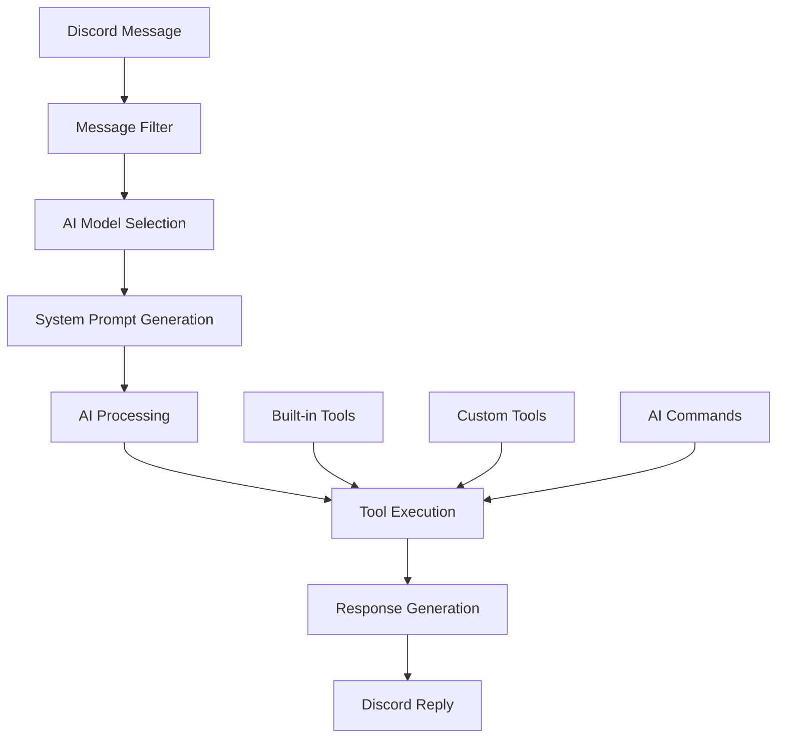

# AI System Overview

CommandKit's AI system provides a comprehensive framework for creating intelligent Discord bots that can understand natural language and execute commands through large language models.

## Architecture Overview

The AI system consists of several key components:



### Core Components

1. **AI Plugin** - Manages the AI system lifecycle and message processing
2. **Configuration System** - Handles AI model selection and behavior customization
3. **Context Management** - Provides request context and state management
4. **Tool System** - Enables AI to execute functions and commands
5. **Command Integration** - Allows existing commands to be AI-accessible

## Key Features

### Natural Language Processing

The AI system can understand natural language requests and map them to specific commands:

```
User: "Can you ban @user for spamming?"
AI: Executes ban command with user parameter and reason
```

### Dynamic Model Selection

Choose different AI models based on context:

```ts
selectAiModel: async (ctx, message) => {
  if (message.member?.permissions.has('Administrator')) {
    return { model: premiumModel }; // Better model for admins
  }
  return { model: standardModel };
};
```

### Built-in Discord Integration

The AI has access to Discord-specific information:

- Server/guild information
- User and role data
- Channel management
- Permission checking
- Message history

### Extensible Tool System

Create custom tools for AI to use:

```ts
const customTool = createTool({
  name: 'weather',
  description: 'Get weather information',
  parameters: z.object({
    location: z.string(),
  }),
  execute: async (ctx, params) => {
    return await getWeatherData(params.location);
  },
});
```

## AI Command Flow

### 1. Message Reception

```ts
// Discord message received
message: 'Hey bot, can you play some music?';
```

### 2. Message Filtering

```ts
messageFilter: async (message) => {
  return message.mentions.users.has(message.client.user.id);
};
```

### 3. Context Creation

```ts
const ctx = new AiContext({
  message,
  params: {},
  commandkit,
});
```

### 4. AI Processing

```ts
const result = await generateText({
  model,
  prompt: userMessage,
  system: systemPrompt,
  tools: availableTools,
});
```

### 5. Tool Execution

```ts
// AI decides to use the music command
await musicCommand.ai({
  action: 'play',
  query: 'music',
});
```

### 6. Response Generation

```ts
await message.reply('🎵 Now playing music!');
```

## Configuration Levels

### Basic Configuration

```ts
configureAI({
  selectAiModel: async () => ({ model: myModel }),
  messageFilter: async (message) =>
    message.mentions.users.has(message.client.user.id),
});
```

### Advanced Configuration

```ts
configureAI({
  selectAiModel: async (ctx, message) => ({
    model: selectBestModel(message),
    maxSteps: 10,
    temperature: 0.7,
  }),
  messageFilter: customMessageFilter,
  prepareSystemPrompt: customSystemPrompt,
  onProcessingStart: startProcessing,
  onResult: handleResult,
  onError: handleError,
});
```

## Security Considerations

### Permission Validation

```ts
export async function ai(ctx: AiContext) {
  if (!ctx.message.member?.permissions.has('RequiredPermission')) {
    throw new Error('Insufficient permissions');
  }
  // Continue with command
}
```

### Input Sanitization

```ts
const sanitizedInput = sanitizeInput(ctx.ai.params.userInput);
```

### Rate Limiting

```ts
const rateLimiter = new RateLimiter(5, 60000); // 5 requests per minute
```

## Performance Optimization

### Caching

```ts
const cache = new Map();
const cachedResult = cache.get(cacheKey) || (await expensiveOperation());
```

### Async Processing

```ts
// Handle long operations asynchronously
processLongOperation(params).then((result) => {
  message.reply(`Operation completed: ${result}`);
});
```

### Efficient Database Queries

```ts
// Batch operations instead of individual queries
const users = await database.user.findMany({
  where: { id: { in: userIds } },
});
```

## Error Handling

### Graceful Degradation

```ts
try {
  return await primaryMethod();
} catch (error) {
  console.warn('Primary method failed, using fallback');
  return await fallbackMethod();
}
```

### User-Friendly Messages

```ts
catch (error) {
  const userMessage = getHumanReadableError(error);
  await message.reply(userMessage);
}
```

## Best Practices

1. **Always validate permissions** before executing sensitive operations
2. **Sanitize user inputs** to prevent injection attacks
3. **Implement rate limiting** to prevent abuse
4. **Use structured error handling** for better user experience
5. **Cache frequently accessed data** for better performance
6. **Log operations** for debugging and monitoring
7. **Test AI commands thoroughly** before deployment

## Integration Examples

### Music Bot

```ts
"Play some rock music" → musicCommand.ai({ action: 'play', genre: 'rock' })
```

### Moderation

```ts
"Timeout @user for 10 minutes" → moderationCommand.ai({ action: 'timeout', user: 'id', duration: 600 })
```

### Server Management

```ts
"Create a new text channel called general" → adminCommand.ai({ action: 'create-channel', name: 'general', type: 'text' })
```

## Getting Started

1. **Install the AI package**: `npm install @commandkit/ai`
2. **Configure your AI model** in `src/ai.ts`
3. **Create AI-compatible commands** with `aiConfig` and `ai` functions
4. **Test your setup** with simple commands
5. **Gradually add more complex functionality**

## Next Steps

- [AI Configuration](./02-ai-configuration.mdx) - Set up your AI models
- [Creating AI Commands](./03-ai-commands.mdx) - Make commands AI-accessible
- [Custom Tools](./06-custom-tools.mdx) - Extend AI capabilities
- [Best Practices](./07-best-practices.mdx) - Production-ready implementations
