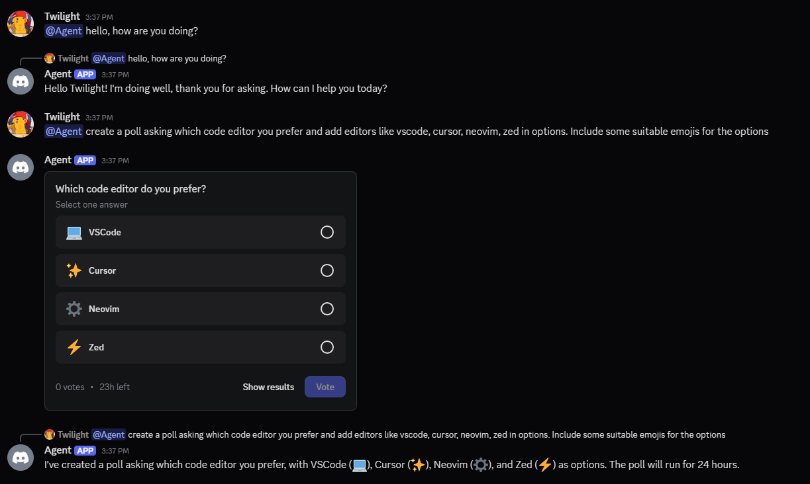
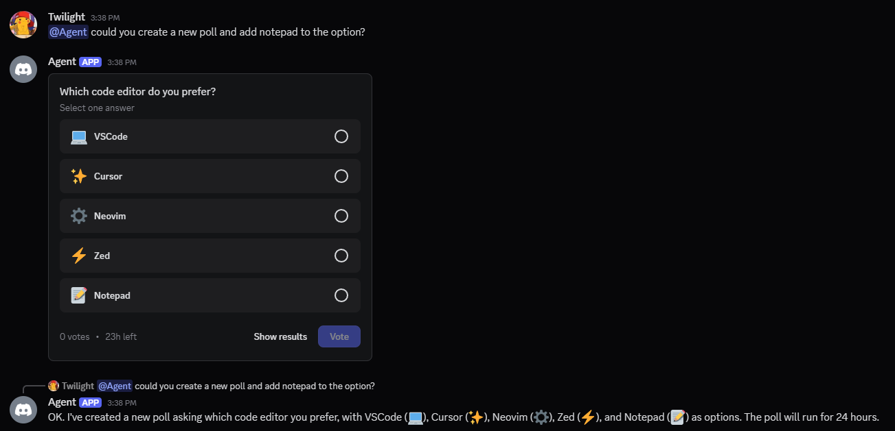
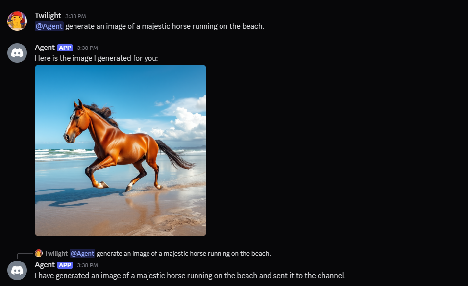
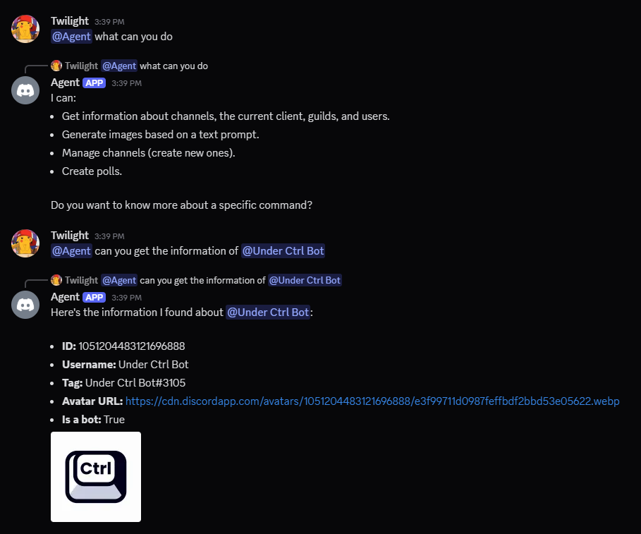

# Agent 🤖

Agent is an advanced AI-powered Discord bot built with [CommandKit](https://commandkit.dev/) that leverages natural language processing to provide an intuitive and powerful interaction experience. Built with modern technologies, it offers a seamless way to manage Discord servers and engage with communities through various features.

## ✨ Features

- **Natural Language Commands**: Interact with the bot using everyday language
- **Channel Management**: Create and manage Discord channels effortlessly
- **Interactive Polls**: Create and manage polls with natural language inputs
- **AI Image Generation**: Generate images from text descriptions using Clipdrop API
- **Smart Chatbot**: Engage in natural conversations with context awareness
- **Google AI Integration**: Leverage Google's AI capabilities for enhanced features

> [!NOTE]
> This repository is just a simple example of what can be built with Agent. The actual implementation may vary based on your specific needs and requirements.

> Did you know that this project was vibe coded? 🤖 You can do that yourself by utilizing https://commandkit.dev/llms.txt in your code editor such as Cursor.

## 🚀 Getting Started

### Prerequisites

- [Node.js](https://nodejs.org/) (v22 or higher)
- A Discord bot token
- Google API key
- Clipdrop API key

### Installation

1. Clone the repository:

```bash
git clone https://github.com/underctrl-io/agent.git
cd agent
```

2. Install dependencies:

```bash
npm install
```

3. Configure environment variables:
   Create a `.env` file in the root directory with the following variables:

```env
DISCORD_TOKEN="your_discord_token"
GOOGLE_API_KEY="your_google_api_key"
CLIPDROP_API_KEY="your_clipdrop_api_key"
```

You can obtain the required API keys from:

- Discord Token: [Discord Developer Portal](https://discord.com/developers/applications)
- Google API Key: [Google AI Studio](https://aistudio.google.com/apikey)
- Clipdrop API Key: [Clipdrop API Documentation](https://clipdrop.co/apis/docs/text-to-image)

4. Start the bot:

```bash
npm run dev
```

## 🎯 Features Showcase

### Natural Language Poll Creation

Create polls using everyday language. The bot understands context and can handle follow-up questions naturally.




### AI Image Generation

Generate images from text descriptions using natural language prompts.



### Context-Aware Chatbot

Engage in natural conversations with the bot that maintains context and provides relevant responses.



## 🤝 Contributing

Contributions are welcome! Please feel free to submit a Pull Request. For major changes, please open an issue first to discuss what you would like to change.

1. Fork the repository
2. Create your feature branch (`git checkout -b feature/AmazingFeature`)
3. Commit your changes (`git commit -m 'Add some AmazingFeature'`)
4. Push to the branch (`git push origin feature/AmazingFeature`)
5. Open a Pull Request

## 🙏 Acknowledgments

- [Discord.js](https://discord.js.org/) for the Discord API wrapper
- [CommandKit](https://commandkit.dev/) for the Discord.js framework with AI capabilities
- [Google AI](https://ai.google/) for generative AI models
- [Clipdrop](https://clipdrop.co/) for image generation API
